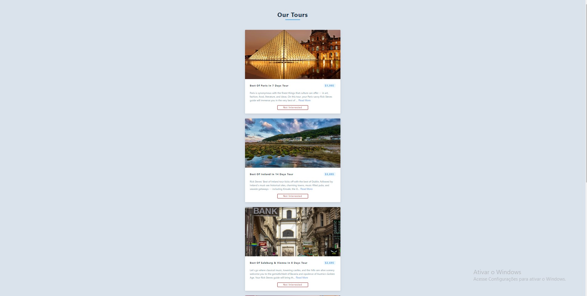

## Tour !  ✈️ 🌄 🏝️
 

## With (useEffect and Conditional Rendering) React-JS ! 💻 📚
 

## Technologies I used for the project ;  

 
    
    
    
    

 

## Idea 🥰

;

#### IN ACTION

[Tours](https://alisson-aguiars2k.github.io/tours/)